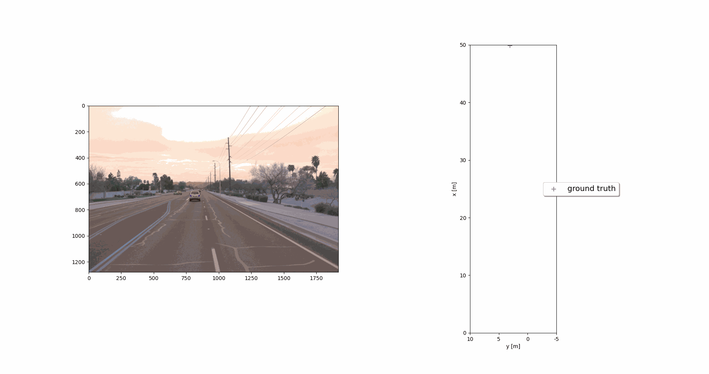
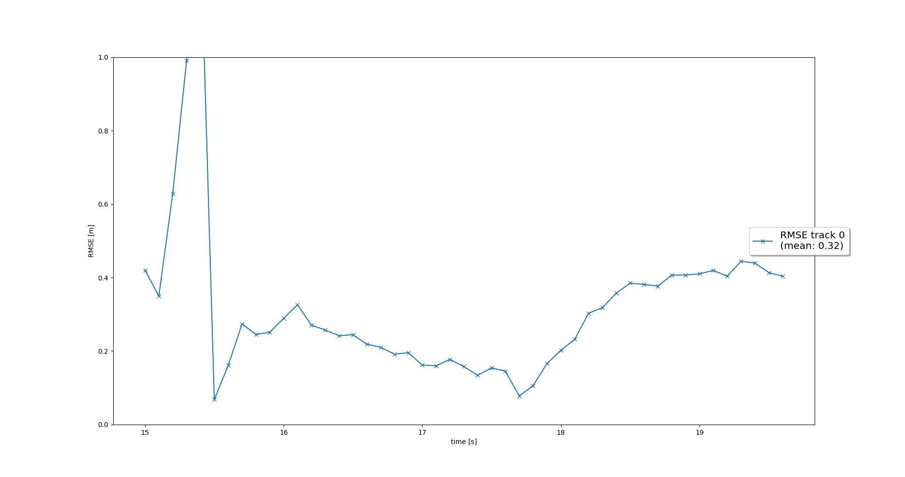
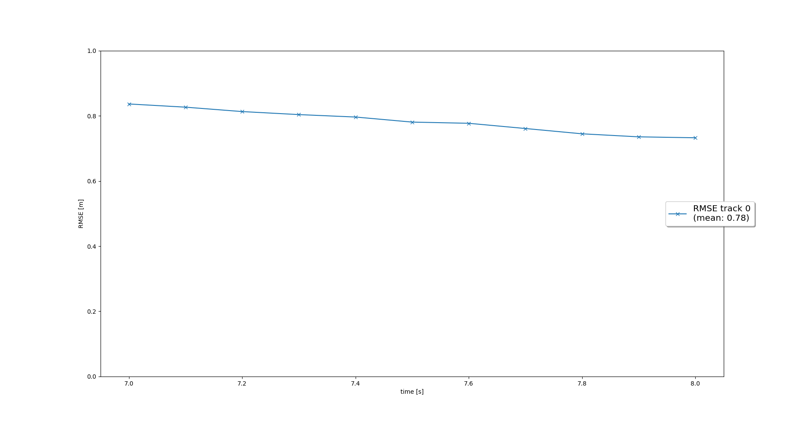
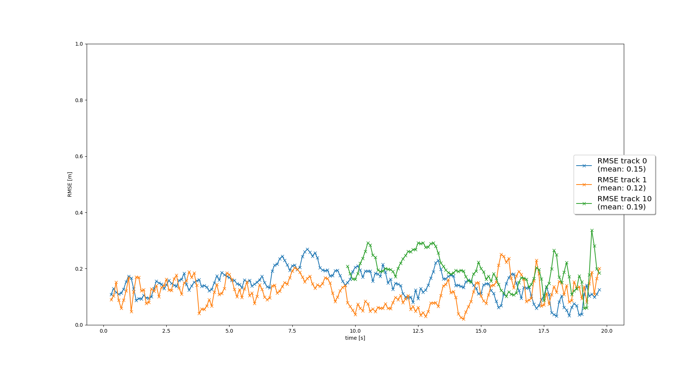
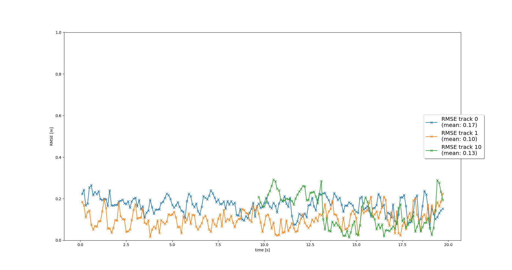

# Final Project: Sensor Fusion and Object Tracking

## Table of Contents
- [Track objects over time with a Kalman Filter](#step1)
- [Initialize, update and delete tracks](#step2)
- [Associate measurements to tracks with nearest neighbor association](#step3)
- [Fuse measurements from lidar and camera](#step4)
- [Questions](#step5)

## Track objects over time with a Kalman Filter {#step1}

In the first step, an extended Kalman filter is used to track a single target with a single LiDAR sensor. The tasks were implementing the  EKF prediction and updating steps, including the system matrix, `F` and the process noise matrix `Q` for the constant velocity motion model, the mesurement matrix `H` for LiDAR sensor. Figure 1.1 shows an animation of tracking results and Figure 1.2 shows the mean RMSE values, that is smaller than 0.35.

<table style="border-style:hidden">
<tr style="border-style:hidden">
  <td style="border-style:hidden">
    
    <figcaption align = "center">Figure 1.1. Target tracking.</figcaption>
  </td>
  <td>
    
    <figcaption align = "center">Figure 1.2. RMSE.</figcaption>
  </td>
</tr>
<tr style="border-style:hidden">
  <td colspan="2" style="border-style:hidden"><figcaption align = "center">Figure 1. Single target tracking results.</figcaption></td>
</tr>
</table>

## Initialize, update and delete tracks {#step2}
In this step, it was implemented the track management to initialize and delete tracks, to set a track state and a tracking score. Figure 2.1 shows the multi-target tracking, being the new track initialized automatically where unassigned measurements occur, the true track is confirmed quickly, and the track is deleted after it has vanished from the visible range. Figure 2.2 shows the mean RMSE.

<table style="border-style:hidden">
<tr style="border-style:hidden">
  <td style="border-style:hidden">
    
    <figcaption align = "center">Figure 2.1. Target tracking.</figcaption>
  </td>
  <td>
    
    <figcaption align = "center">Figure 2.2. RMSE.</figcaption>
  </td>
</tr>
<tr style="border-style:hidden">
  <td colspan="2" style="border-style:hidden"><figcaption align = "center">Figure 2. Single target tracking results.</figcaption></td>
</tr>
</table>

## Associate measurements to tracks with nearest neighbor association {#step3} 
In this step, it was implemented a single nearest neighbor data association to associate measurements to tracks. Figure 3.1 shows the target tracking, where it is possible to visualize multiple tracks being updated with multiple measurements. It is still possible to see some initialized or tentative “ghost tracks” then being deleted after several frames. Figure 3.2 shows the mean RMSE.

<table style="border-style:hidden">
<tr style="border-style:hidden">
  <td style="border-style:hidden">
    
    <figcaption align = "center">Figure 3.1. Targets tracking.</figcaption>
  </td>
  <td>
    
    <figcaption align = "center">Figure 3.2. RMSE.</figcaption>
  </td>
</tr>
<tr style="border-style:hidden">
  <td colspan="2" style="border-style:hidden"><figcaption align = "center">Figure 3. Multi target tracking results.</figcaption></td>
</tr>
</table>

## Fuse measurements from lidar and camera {#step4}
In this step, it was implemented multiple object detection and tracking by using both camera and lidar measurements. Figure 4.1 shows the target tracking, and Figure 4.2 shows the mean RMSE. Notice that the mean RMSE is below 0.25.

<table style="border-style:hidden">
<tr style="border-style:hidden">
  <td style="border-style:hidden">
    
    <figcaption align = "center">Figure 4.1. Targets tracking.</figcaption>
  </td>
  <td>
    
    <figcaption align = "center">Figure 4.2. RMSE.</figcaption>
  </td>
</tr>
<tr style="border-style:hidden">
  <td colspan="2" style="border-style:hidden"><figcaption align = "center">Figure 4. Multi target tracking results.</figcaption></td>
</tr>
</table>

## Questions {#step5}

**Do you see any benefits in camera-lidar fusion compared to lidar-only tracking (in theory and in your concrete results)?**
In theory, both sensors yield redundant information about the target location. By having redundant target location measurements the uncertainty of tracking decreases. In addition, the redundant information is useful to supply the different deficiencies of each sensor. In our experiments, the benefits of sensor fusion can be numerically seen by the reduction of multi-target tracking mean RMSE value.

**Which challenges will a sensor fusion system face in real-life scenarios? Did you see any of these challenges in the project?**
In real-life scenarios, the performance of the measurement could be heavily affected by environmental conditions, e.g. fog, rain, etc. Another problem, that can happen in real-life are intrinsic calibration errors, yielding wrong coordinate transformation.

**Can you think of ways to improve your tracking results in the future?**
A possible way to improve is to use a Radar sensor to measure target velocity directly, thus improving the prediction step, which uses a constant velocity model. Another possibility is to better tune the covariance matrices `Q` and `R`, reflecting the uncertainties of the prediction model and measurements, respectively.