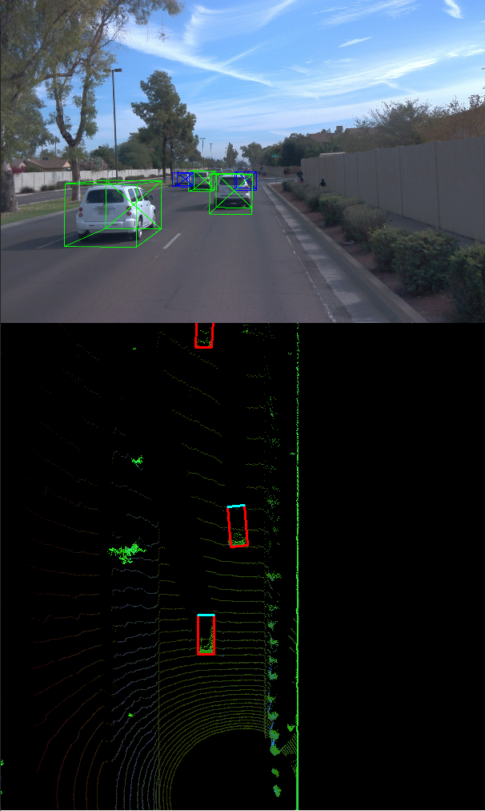
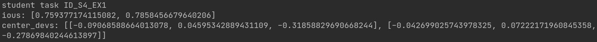

# Mid-Term Project: 3D Object Detection

## Table of Contents
- [Compute Lidar Point-Cloud from Range Image](#compute-lidar-point-cloud-from-range-image)
    - [Visualize range image channels (ID_S1_EX1)](#-visualize-range-image-channels-id_s1_ex1)
    - [Visualize point-cloud (ID_S1_EX2)](#-visualize-point-cloud-id_s1_ex2)
- [Create Birds-Eye View from Lidar PCL](#-create-birds-eye-view-from-lidar-pcl)
    - [Convert sensor coordinates to bev-map coordinates (ID_S2_EX1)](#-convert-sensor-coordinates-to-bev-map-coordinates-id_s2_ex1)
    - [Compute intensity layer of bev-map (ID_S2_EX2)](#-compute-intensity-layer-of-bev-map-id_s2_ex2)
    - [Compute height layer of bev-map (ID_S2_EX3)](#-compute-height-layer-of-bev-map-id_s2_ex3)
- [Model-based Object Detection in BEV Image](#-model-based-object-detection-in-bev-image)
    - [Add a second model from a GitHub repo (ID_S3_EX1)](#-add-a-second-model-from-a-github-repo-id_s3_ex1)
    - [Extract 3D bounding boxes from model response (ID_S3_EX2)](#-extract-3d-bounding-boxes-from-model-response-id_s3_ex2)
- [Performance Evaluation for Object Detection](#-performance-evaluation-for-object-detection)
    - [Compute intersection-over-union (IOU) between labels and detections (ID_S4_EX1)](#-compute-intersection-over-union-iou-between-labels-and-detections-id_s4_ex1)
    - [Compute false-negatives and false-positives (ID_S4_EX2)](#-compute-false-negatives-and-false-positives-id_s4_ex2)
    - [Compute precision and recall (ID_S4_EX3)](#-compute-precision-and-recall-id_s4_ex3)

## Compute Lidar Point-Cloud from Range Image
### Visualize range image channels (ID_S1_EX1)
<figure>

<figcaption align = "center">Figure 1. Range Image for frame 0.</figcaption>
</figure>
<figure>

<figcaption align = "center">Figure 2. Range Image for frame 1.</figcaption>
</figure>


### Visualize point-cloud (ID_S1_EX2)
It is possible to identify the following features:
 - objects that are near the vehicle and inside the LiDAR line of view, have more points. The surface of these objects is more detailed;
 - the windshields and lateral glass windows cannot be effectively detected by LiDAR;
 - due to reflective properties, the opaque parts  of the vehicles can be detected more effectively;
 - there are occlusion points near the vehicle, which is impossible to detect objects;
 - objects far from the vehicle cannot be detailed detected;
 - small objects are not detected far from the vehicle, even inside the LiDAR line of view. 

<figure>

<figcaption align = "center">Figure 3. The lidar point-cloud in a superior view.. </figcaption>
</figure>
<figure>

<figcaption align = "center">Figure 4. The lidar point-cloud in a perspective view.</figcaption>
</figure>


## Create Birds-Eye View from Lidar PCL
### Convert sensor coordinates to bev-map coordinates (ID_S2_EX1)
<figure>

<figcaption align = "center">Figure 5. Visualization into BEV map coordinates.</figcaption>
</figure>


### Compute intensity layer of bev-map (ID_S2_EX2)
<figure>

<figcaption align = "center">Figure 6. Intensity layer from the BEV map.</figcaption>
</figure>


### Compute height layer of bev-map (ID_S2_EX3)
<figure>

<figcaption align = "center">Figure 6. Height layer from the BEV map.</figcaption>
</figure>


## Model-based Object Detection in BEV Image
### Add a second model from a GitHub repo (ID_S3_EX1)
```python
####### ID_S3_EX1-3 START #######     
#######

print("student task ID_S3_EX1-3")

configs.model_path = os.path.join(parent_path, 'tools', 'objdet_models', 'resnet')
configs.pretrained_filename = os.path.join(configs.model_path, 'pretrained', 'fpn_resnet_18_epoch_300.pth')
configs.arch = 'fpn_resnet'
configs.pretrained_path = configs.pretrained_filename
configs.K = 50
configs.no_cuda = True
configs.gpu_idx = 0
configs.num_samples = None
configs.num_workers = 1
configs.batch_size = 1
configs.peak_thresh = 0.2
configs.save_test_output = False
configs.output_format = 'image'
configs.output_video_fn = 'out_fpn_resnet'
configs.output_width = 608
configs.conf_thresh = 0.5

configs.pin_memory = True
configs.distributed = False

configs.input_size = (608, 608)
configs.hm_size = (152, 152)
configs.down_ratio = 4
configs.max_objects = 50

configs.imagenet_pretrained = False
configs.num_layers = 18
configs.head_conv = 64
configs.num_classes = 3
configs.num_center_offset = 2
configs.num_z = 1
configs.num_dim = 3
configs.num_direction = 2 

configs.heads = {
    'hm_cen': configs.num_classes,
    'cen_offset': configs.num_center_offset,
    'direction': configs.num_direction,
    'z_coor': configs.num_z,
    'dim': configs.num_dim
}
configs.num_input_features = 4

#######
####### ID_S3_EX1-3 END #######   
```

```python

####### ID_S3_EX1-4 START #######     
#######

print("student task ID_S3_EX1-4")
model = fpn_resnet.get_pose_net(num_layers=configs.num_layers, heads=configs.heads, head_conv=configs.head_conv,
                                imagenet_pretrained=configs.imagenet_pretrained)

#######
####### ID_S3_EX1-4 END #######

```
### Extract 3D bounding boxes from model response (ID_S3_EX2)
<table style="border-style:hidden">
<tr style="border-style:hidden">
  <td style="border-style:hidden">
    
    <figcaption align = "center">Figure 7.1. Frame 50.</figcaption>
  </td>
  <td>
    
    <figcaption align = "center">Figure 7.2. Frame 51.</figcaption>
  </td>
</tr>
<tr style="border-style:hidden">
  <td colspan="2" style="border-style:hidden"><figcaption align = "center">Figure 7. 3D bounding boxes added to the images.</figcaption></td>
</tr>
</table>

## Performance Evaluation for Object Detection
### Compute intersection-over-union (IOU) between labels and detections (ID_S4_EX1)
<table style="border-style:hidden">
<tr style="border-style:hidden">
  <td style="border-style:hidden">
    
    <figcaption align = "center">Figure 8.1. Frame 50.</figcaption>
  </td>
  <td>
    
    <figcaption align = "center">Figure 8.2. Frame 51.</figcaption>
  </td>
</tr>
<tr style="border-style:hidden">
  <td colspan="2" style="border-style:hidden"><figcaption align = "center">Figure 8. `ious` and `center_devs` values.</figcaption></td>
</tr>
</table>

### Compute false-negatives and false-positives (ID_S4_EX2)
<table style="border-style:hidden">
<tr style="border-style:hidden">
  <td style="border-style:hidden">
    
    <figcaption align = "center">Figure 9.1. Frame 50.</figcaption>
  </td>
  <td>
    
    <figcaption align = "center">Figure 9.2. Frame 51.</figcaption>
  </td>
</tr>
<tr style="border-style:hidden">
  <td colspan="2" style="border-style:hidden"><figcaption align = "center">Figure 9. `det_performance` values.</figcaption></td>
</tr>
</table>

### Compute precision and recall (ID_S4_EX3)
```
student task ID_S4_EX3
precision = 0.9928057553956835, recall = 0.9019607843137255
```
<figure>

<figcaption align = "center">Figure 10. Performance metrics.</figcaption>
</figure>

<figure>

<figcaption align = "center">Figure 11. Performance metrics using ground truth.</figcaption>
</figure>